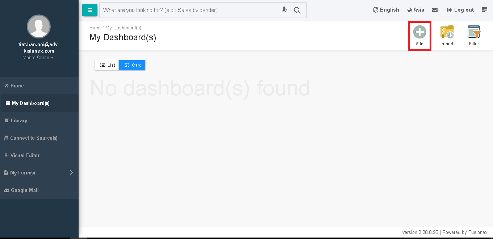
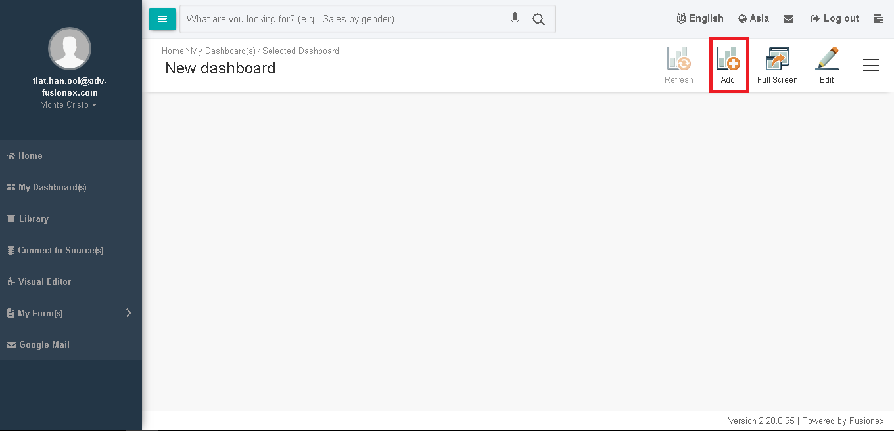
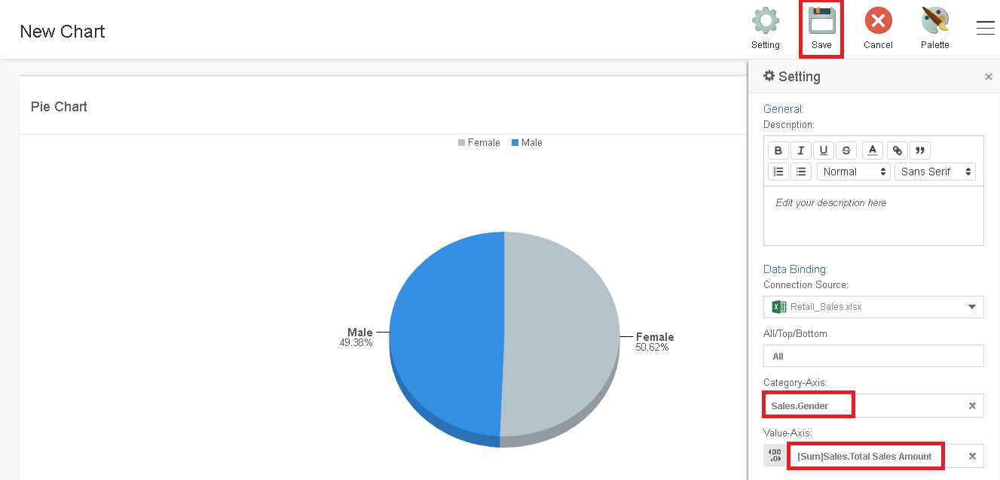
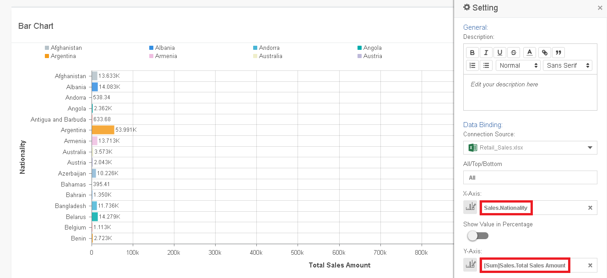

# GIANT for beginner 

## Introduction
This guide shows you how GIANT analytic works and how you can use GIANT visual aid in analysis.
This guide includes:
- How to upload your data source to GIANT
- How to use pie chart for analysis
- How to use simple bar chart for analysis

### Prerequisite
* Have access to GIANT
* A data source

## Uploading Source to GIANT
1. Sign in to [GIANT](https://giant2016-csgb.fusionexsite.com/AnalyticsI) or [GIANT in bison](http://giant-bison.fusionexsite.com/Websites/Analytics). 
2. Press the menu button on the top left of the web and choose Connect to Source(s).
   
3. Choose your source file type from the list of file type.
3. Drag the file or press Choose a File to upload source. 
4. Wait for the file to be uploaded.

## Creating a Dashboard
1. Go to My Dashboard(s) and press Add icon to add a new dashboard.
 
2. To change the name of your dashbaord, click on the name of the dashboard and you can make the changes required.
   Just press away from the name to save the changes.

## How can GIANT be useful

In the previous sections, you have learnt on how to upload data source and create dashboard in GIANT. In this section, you will learn how to use GIANT to analyse the data.

### Background

Company A is a company that has different businesses in different countries. Company A wants to know whether male or female spend more money on their businesses.  Company A also want to know the distribution of sales in each country. 

### Determine the Sales on Gender

Company A want to know whether male or female spend more on their businesses.  To visualise this, Company A can create a Sales vs Gender pie chart to get a clear view on which gender is more profitable.

1. Press on view dashboard button on the any of the dashboards.
2. Press on add icon to add a new chart.
 
3. Select Pie on the Chart Selection and press Source icon.
 
4. Select the data source file and press proceed icon.
5. Select your Gender for Category-Axis and Sales for the Value-Axis. The Sales vs Gender pie chart will be created.
 
6. Press on save to save the pie chart on your dashboard for future reference.

Company A can determine which gender is spending more on their businesses based on the pie chart.

### Determine the Sales generated by each Country

To determine whether there is a need to change the product based on country culture, Company A need to go through all the sales for each country. To achieve this, Company A can create a bar chart to visualise the sales generated by each country.
1. Press add icon to add a new chart.
2. Select Bar on the Chart Selection and press Source icon.
3. Select the your source file and press proceed icon.
4. Select your desired field for X-Axis and Y-Axis. The Y-Axis by X-Axis bar chart will be created.
 

Company A can go through the list of countries in the bar chart to see how their businesses do in each country.
