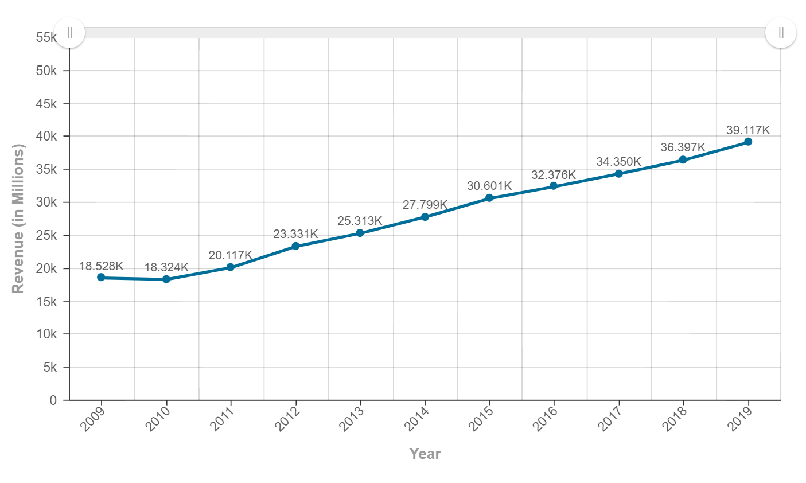
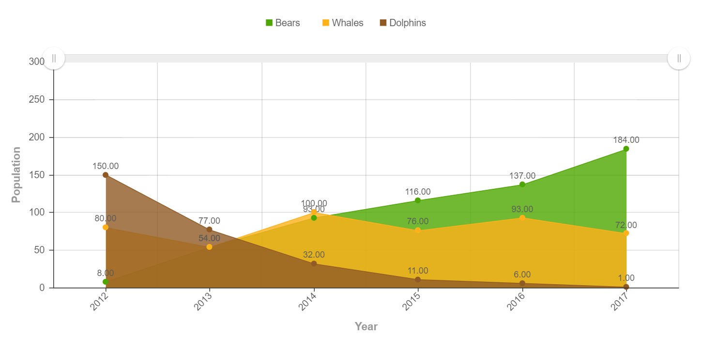

## Line and Area Chart

 

A Line/Area graph is a representation of a trend(Line Chart) or cumulated totals(Area Chart) over time, often in chronological order. They are both similar in a sense that their data would be displayed with an initial line to display their values throughout the timeline, having the differences of the chart being only a line(Line Chart) or having a filled graph(Area Chart), thus making the data sources very interchangable among the two. These two charts are used to show the trend or comparison between the categories of data, where analysts can take note of the change within the patterns of the data to provide on strategies based on the change.

## Data Binding

For both line and area charts, there are only two mandatory bindings to generate the chart which are the **X-Axis** and **Y-Axis**. However, to analyse both chart properly, the **Group** field should also be binded to fulfill in order for the charts to render correctly, as shown below:

|Bindings|Data Type|
|---|---|
|X-Axis|Text, Date|
|Y-Axis|Numeric|
|Group|Category(Text or Date)|

### X-Axis

A field with Text or Date data type can be used for **X-Axis** binding. This will be displayed as the Category values.

### Y-Axis

A field with Numeric data type can be used for **Y-Axis** binding. This will display the measurement of the values.

### Group

The **Group** binding determines the category to use to group **X-Axis** values in the chart. It can be a Date or Text data type.

## Other Settings

### All/Top/Bottom

By default, the option selected is All (which means, all the data points will be shown in the chart). Select Top or Bottom, followed by the number of data points required to show the selected number of top-most data rows **OR** selected number of bottom-most data rows.

### Drill Down

If your data contains hierarchy (for example: Region > Country > State), you can use this field to drill down your data from the highest level to the lower levels.

### Sort

You can use this setting to arrange your data points based on the field that you need. For example, to sort by Country in ascending order.

### Filter

Add filters to restrict your data so that analysis will be focused on data which are shown in the chart.

## Use Cases
### Nike Revenue Sales from 2009 to 2019 (Line Chart)
A dataset by Nike is used to display their revenue sales from the year of 2009 to 2019. A line chart will be used to display the data. Download sample data [here](./sample-data/area-line-graph/nike-revenue-worldwide.xlsx).

Provided within the dataset are the necessary fields needed to generate the line chart. As the only bindings needed to produce the chart are **X-Axis** and **Y-Axis**, the **Year** and **Revenue (in Millions)** column fields are used to fill in those bindings respectively.

|Bindings|Select|
|---|---|
|X-Axis|Year|
|Y-Axis|Revenue(in Millions)|

Displayed within the line chart, the line graph has a steady increase from its initial point to its end point. This can be said as Nike has a constant growth in their revenue as the years pass on. Their highest revenue count is from the year of 2019, where they earned 39.117 million US dollars on their revenue, which is an 8.3% increase in revenue as compared to 2018, where had 36.397 million US dollars in revenue. As the revenue is on a steady path of increase, Nike could continue their current marketing and business plans in the future to gain a steady revenue increase, along with setting the trend line as a guide to see which years had the most revenue increase when compared to their previous years, where they could implement their marketing strategies from said years into future endeavours.

**Output**

### Wildlife Population throughout the Years (Area Chart)
A sample dataset is used for the area chart, where the Wildlife Population for 3 animals(Bears, Dolphins and Whales) are displayed throughout the years of 2012 to 2017. An area chart will be used to display the data in a grouped format. Download sample data [here](./sample-data/area-line-graph/Wildlife_Population.xlsx).

Provided within the dataset are the necessary fields needed to generate the area graph. The **Year** field will be placed in the **X-Axis** setting, whereas the **Population** field will be placed in the **Y-Axis** setting. As there are multiple animals listed within the dataset, the **Group** setting will be used to categorise them into different charts.

|Bindings|Select|
|---|---|
|X-Axis|Year|
|Y-Axis|Population|
|Group|Animals|

Displayed within the chart are the total number of wildlife animals remaining, where each of the animals have a varied counts throughout the years, where Bears have an exponentially increasing count throughout the years, as opposed to Dolphins which are quickly declining in their population year after year. Not only that, the Whales have a constant increase and decrease in their count throughout the years of 2012 to 2017.

**Output**

**Analysis**

The conclusion of the use case chart displays the population of three different animals within the years of 2012 to 2017, where the highest count of population is Bears in 2017, having the count of 184, where it has an increasing number from their initial starting point of 2012. Another note to point out is the count of Dolphins drastically depleting within the timeline of 2012 to 2017, having the count of only 1 in the year of 2017, whereas it had the highest count of 150 in their initial year when compared to the other animals. The Whales population have a steady population count year by year, ranging their population count from 54 - 100. By analysing this graph, wildlife conservation organisations could take the initiative to focus on preserving the Dolphins due to their very low count as of 2017, finding methods to save their environment to increase the count of Dolphins for the future years. Furthermore, the same could be said for the Whales count as the constant increase and decrease of their count could be improved to have a steady growth in their population.