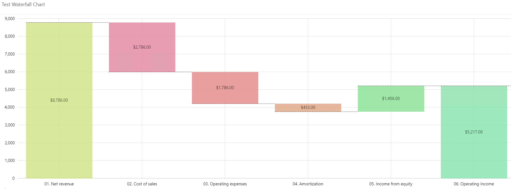
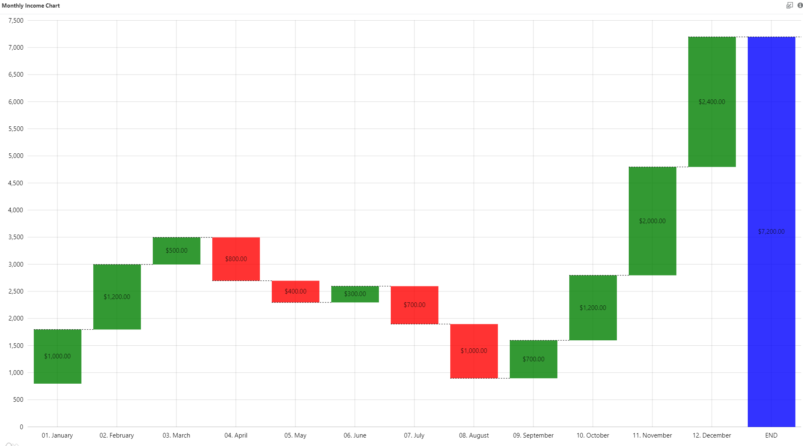

# Waterfall Chart
A waterfall chart is a form of data visualization that helps in understanding the cumulative effect of sequentially introduced positive or negative values. These intermediate values can either be time based or category based. The waterfall chart is also known as a flying bricks chart or Mario chart due to the apparent suspension of columns (bricks) in mid-air. Often in finance, it will be referred to as a bridge.

## Diagram Design / Configuration

### Binding
- The bindings required are Category, Value, Open Value and StepValue.

    >Category shows a name for a certain category. 

    >Open Value shows the existing amount before the current category is applied. 

    >Value reflects the amount after the current category is applied. 

    >StepValue presents the difference between current value and initial value. 

  
* The optional bindings are:
    * `Color` binding which binds the color of the nodes
    * `Display Value` that shows the difference between amounts before a category was applied and after.

 
Sample data download [here](./sample-data/waterfall-chart/sampleData1.csv).

## Use cases

### Costs, expenses and operative income  
   
This dataset shows all finance costs, expenses, income and net revenue of a company for a given period of time. We can see that the major expense for the company is a cost of sales, followed by operating expenses.

./images/sankey-diagram/show-percentage.PNG

Sample data download [here](./sample-data/waterfall-chart/sampleData1.csv).

### Monthly Income Chart
   
This dataset shows overall year income based on every month profit and loss. 

Sample data download [here](./sample-data/waterfall-chart/sampleData2.csv).
